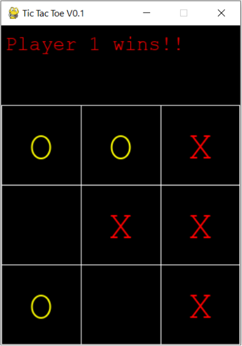

# ❌ Tic Tac Toe ⭕
A Tic Tac Toe game made using Pygame Tkinter and Numpy. The game functions are all written in Python and the matrix for the game is created using Numpy and the GUI for the Game is developed using Pygame. The dialog boxes indicating the player who has won or if it was a draw are all developed using Tkinter.

## Initializing the game 👾
The game initializes by creating a matrix using Numpy as `np.zeroes()` which takes 2 arguments: row and column, and then creates a 3x3 matrix containing all elements as 0s.
```Python
def create_board():
    board = np.zeros((row_count, column_count))
    return board
```
And then it creates a board using Pygame
```Python
def draw_board(board):
    for c in range(column_count):
        for r in range(row_count):
            pygame.draw.aaline(screen, white, (0, 100), (300, 100))
            pygame.draw.aaline(screen, white, (0, 200), (300, 200))
            pygame.draw.aaline(screen, white, (0, 300), (300, 300))
            pygame.draw.aaline(screen, white, (0, 400), (300, 400))
            pygame.draw.aaline(screen, white, (0, 100), (0, 400))
            pygame.draw.aaline(screen, white, (100, 100), (100, 400))
            pygame.draw.aaline(screen, white, (200, 100), (200, 400))
            pygame.draw.aaline(screen, white, (299, 100), (299, 400))
    pygame.display.update()
```

## Checking for a valid move ✅
The function `is_valid_move()` checks whether a move is valid before allowing it. 
```Python
def is_valid_move(board, row, column, piece):
    if board[row][column] == piece:
        return True
```

## Deploying Pieces on Board and into a Matrix 🤔
So how does it all work?? The function drop_piece takes in 4 arguments namely: board, piece, row & column. The piece is a numerical value of either '1' or '2' corresponding to the Player number. The piece is entered into the game matrix. The row and column are then decided and then the piece either ❌ or ⭕ is displayed on the Pygame GUI using `screen.blit()` function at a particular row and column intersection.
```Python
def drop_piece(board, piece, row, column):
    if board[row][column] == 0:
        board[row][column] = piece

    row_w = (column*100) + 35
    column_h = (row*100) + 125

    if board[row][column] == 1:
        font = pygame.font.SysFont("monospace", 50)
        img = font.render("X", 1, Red)
        screen.blit(img, (int(row_w), int(column_h)))
    elif board[row][column] == 2:
        font = pygame.font.SysFont("monospace", 50)
        img = font.render("O", 1, Yellow)
        screen.blit(img, (int(row_w), int(column_h)))

```

## Checking for a Draw! 😑
We really hate it when there's a draw but we have to include it. So when no player is winning, the `is_draw()` function checks if there are any availabe spaces i.e. it checks if there are any zeroes in the matrix.
```Python
def is_draw(board, row, col):
    if board.min()!=0:
        return True
```

## Checking for a Winner ✨
The winner player is determined by checking in 4 different ways: row wise, column wise, and 2 ways diagonally.
```Python
def winning_move(board, piece):
    #Loop for Checking winning condition horizontally
    for row in range(row_count):
        if (board[row][0] == piece) and (board[row][1] == piece) and (board[row][2] == piece):
            return True

    #Loop for Checking winning condition vertically
    for column in range(column_count):
        if (board[0][column] == piece) and (board[1][column] == piece) and (board[2][column] == piece):
            return True
        
    #Loop for Checking winning condition in positive slope
    if (board[2][0] == piece) and (board[1][1] == piece) and (board[0][2] == piece):
            return True

    #Loop for Checking winning condition in negative slope
    if (board[0][0] == piece) and (board[1][1] == piece) and (board[2][2] == piece):
            return True
```

## The Game Function 👑
The game function is the real hero 🐱‍🏍that brings it all together it takes the parameter turn which determines which one of the player gets to go first. It declares all the necessary functions like closing window when X is clicked. Then according to whose turn it is, whenever the mouse is in motion, the player whose turn it is, is refected on the top of the UI and then the display is updated. Then the row and column is detected by the position of the mouse pointer. Then accoring to which player's turn it is, the program sequentially drops a piece, checks for a winning move, checks if there are valid moves an then changes the turn at the end it checks if it is a draw and then it updates the display.
```Python
def game(turn):
    while not gameover:
        for event in pygame.event.get():

            if event.type == pygame.QUIT:
                sys.exit()
            pos = pygame.mouse.get_pos()
            
            if event.type == pygame.MOUSEMOTION:
                pygame.draw.rect(screen, Black, (0, 0, 300, 100))
                if turn == 0:
                    label = myfont.render("Player 1's turn!!", 1, Red)
                    screen.blit(label, (5, 10))
                else:
                    # if ply2=="":
                    label = myfont.render("Player 2's turn!!", 1, Red)
                    screen.blit(label, (5, 10))
            pygame.display.update()

            if event.type == pygame.MOUSEBUTTONDOWN:
                posx = event.pos[0]
                posy = event.pos[1]

                if posy>100 and posy<400:                        
                    posx = event.pos[0]
                    posy = event.pos[1]
                    col = int(math.floor(posx/100))
                    row = int(math.floor(posy/100)) - 1
                
                    if turn == 0:
                        drop_piece(board, 1, row, col)
                        print(board)
                        
                        if winning_move(board, 1):
                            pygame.draw.rect(screen, Black, (0, 0, 300, 100))
                            label = myfont.render("Player 1 wins!!", 1, Red)
                            screen.blit(label, (5, 10))
                            draw_board(board)
                            ask_quit_or_playagain(1, withdraw)

                        if is_valid_move(board, row, col, 1):
                            turn+=1
                            turn%=2

                    elif turn == 1:
                        drop_piece(board, 2, row, col)
                        print(board)

                        if winning_move(board, 2):
                            pygame.draw.rect(screen, Black, (0, 0, 300, 100))
                            label = myfont.render("Player 2 wins!!", 1, Red)
                            screen.blit(label, (5, 10))
                            draw_board(board)
                            ask_quit_or_playagain(2, withdraw)

                        if is_valid_move(board, row, col, 2):
                            turn+=1
                            turn%=2
                    draw_board(board)

                    if is_draw(board, row, col):
                        pygame.draw.rect(screen, Black, (0, 0, 300, 100))
                        label = myfont.render("It's a draw!!", 1, Red)
                        screen.blit(label, (5, 10))
                        ask_quit_or_playagain(0, withdraw)
            pygame.display.update()
```

## Snaps of Game in Action 🎮
<p align=center>
  
  <p align=center>Game UI</p>
</p>

<p align=center>
  
  <p align=center>Game winner Prompt</p>
</p>
